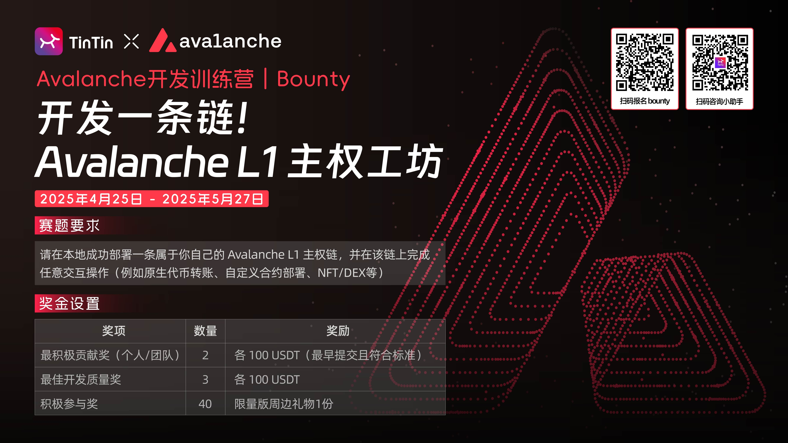

## 一、简介

这个仓库在参加 TintinLand 和 Avalanche 合作举办的社区活动：



这个文档教程包含对以下内容的步骤描述：

1. 在本地启动一条 Avalance 链，叫做 AvNet，代币名称为 AV
2. 在 Metamask 钱包导入账户
3. 在 Metamask 钱包发起原生代币的转账
4. 用 hardhat 部署一个 ERC-20 合约到 AvNet
5. 在 MetaMask 钱包发起 ERC-20 代币的转账

以上所有步骤的命令都来源于官方文档，每个步骤的详细说明可以直接参考官方文档。

具体操作过程提供了视频演示，可以在 YouTube 看到详细的步骤演示：

- https://youtu.be/DxmtOCOtjQQ?si=ZrboPQZ83A1rNl6S

使用的系统环境：

- MacOS

## 二、启动网络

### 1. 安装 avalanche 命令行

```
curl -sSfL https://raw.githubusercontent.com/ava-labs/avalanche-cli/main/scripts/install.sh | sh -s
```

运行结束后，检查命令行是否可用：

```
~/bin/avalanche --version
```

### 2. 创建 AvNet 网络

运行命令：

```
~/bin/avalanche  blockchain create avnet
```

命令执行的过程中，会出现一些选项，如果是选择项，选择默认的第一项就可以。

其中要注意需要输入 chain id 和 token 名称两个信息，这里使用的参数是：

```
Chain ID：2333
Token Name: AV
```

### 3. 部署本地网络

```
~/bin/avalanche blockchain deploy avnet --local
```

这个命令运行需要一些时间，等待运行结束，会看到命令行输出了关于 RPC 信息的日志。

## 三、基础交互

### 1. 导入 MetaMask 钱包

本地节点启动后，默认 prefunding 的账户信息是：

```
地址：0x8db97C7cEcE249c2b98bDC0226Cc4C2A57BF52FC
私钥：56289e99c94b6912bfc12adc093c9b51124f0dc54ac7a766b2bc5ccf558d8027
```

在 MetaMask 钱包用私钥导入账户。

### 2. 添加网络

添加网络需要这四个信息：

- Network Name：AvNet
- RPC：http://127.0.0.1 开头，具体要看上面步骤部署 AvNet 网络的时候，日志输出的 URL
- ChainID：2333
- Token Name：AV

操作完成后，切换网络到 AvNet，就可以看到 MetaMask 上账户对应的余额。

### 3. 代币转账

正常使用 MetaMask 的转账功能就可以，比如发送 AV 代币到另一个账户。

## 四、合约交互

这个仓库的 avdog/ 目录下是一个已经创建好的 hardhat 项目，其中包含一个叫 AVDOG 的 ERC-20 合约，是经过测试的，可以直接使用。

只需要按照以下步骤，简单地配置本地网络的 RPC 信息，就可以完成合约交互。

### 1. 初始化项目

在 avdog/ 目录下，执行命令：

```
npm install
```

### 2. 配置 RPC 信息

复制环境变量的模板文件：

```
cp .env.example .env
```

修改 .env 文件中 `LOCAL_RPC_URL` 的值为你本地刚刚启动的网络 RPC 地址。

### 3. 部署合约

在 avdog/ 目录下，执行命令：

```
npx hardhat run scripts/deploy.js --network local
```

命令结束会打印出合约部署的地址，例如：

```
AVDOG deployed to: 0x<你的合约地址>
```

### 4. 在 MetaMask 钱包转账 ERC-20 代币

MetaMask 钱包有一个 import token 的按钮，导入上面部署的合约地址，就能看到 AVDOG 的余额了。

AVDOG 可以像 USDT 一样正常转账


